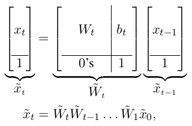

# torch_parallel_scan

A simple implementation of parallel scan over sequences of tensors for PyTorch. It works with any broadcastable binary associative function you specify. Toy example:

```python
import torch
import torch_parallel_scan as tps
DEVICE = 'cuda'  # change as needed

x = torch.randn(8192, 64, 64, device=DEVICE) / (64**0.5)  # seq of 64 x 64 matrices
y = tps.prefix_scan(x, prefix_func=torch.matmul, dim=-3)  # parallel cumul matmuls
```

The entire library is only 40 lines of Python code, excluding docstrings and whitespace.


## Installing

```
pip install git+https://github.com/glassroom/torch_parallel_scan
```

Alternatively, you can download a single file to your project directory: [torch_parallel_scan.py](torch_parallel_scan/torch_parallel_scan.py).

The only dependency is PyTorch.


## Sample Usage


### Cumulative Matrix Multiplication via Parallel Prefix Scan

```python
import torch
import torch_parallel_scan as tps
DEVICE = 'cuda'  # change as needed

n, d = (8192, 64)
x = torch.randn(n, d, d, device=DEVICE) / (d**0.5)        # n square matrices
y = tps.prefix_scan(x, prefix_func=torch.matmul, dim=-3)  # cumulative matmuls
```

### Sequential Chain of Matrix Products via Parallel Reduce Scan

```python
import torch
import torch_parallel_scan as tps
DEVICE = 'cuda'  # change as needed

n, d = (8192, 64)
x = torch.randn(n, d, d, device=DEVICE) / (d**0.5)        # n square matrices
y = tps.reduce_scan(x, reduce_func=torch.matmul, dim=-3)  # matmul of all matrices
```

### Non-Diagonal Recurrences $x_t = W_t x_{t-1} + b_t$ in Parallel

You can compute non-diagonal recurrences of the form $x_t = W_t x_{t-1} + b_t$ in parallel by reformulating them as a sequence of matrix products:



and applying a parallel prefix scan over the reformulated sequence. The direction of `prefix_scan` is left-to-right, as is typical in PyTorch applications, so we multiply on the right, effectively implementing $\tilde{x}^T_t = \tilde{x}^T_0 \tilde{W}^T_1 \tilde{W}^T_2 \dots \tilde{W}^T_t$. Toy example:

```python
import torch
import torch_parallel_scan as tps
DEVICE = 'cuda'  # change as needed

n, d = (8192, 64)
x0 = torch.randn(d, device=DEVICE)                        # initial vector state
W = torch.randn(n, d, d, device=DEVICE) / (d**0.5)        # n left-to-right weights
b = torch.empty(n, d, device=DEVICE).uniform_(-0.1, 0.1)  # n biases

# Formulate as sequence of *left-to-right* matrix products:
mod_W = torch.cat([
    torch.nn.functional.pad(W, (0, 1), value=0),
    torch.nn.functional.pad(b, (0, 1), value=1).unsqueeze(-2),
], dim=-2)
mod_x0 = torch.nn.functional.pad(x0, (0, 1), value=1)

# Compute cumulative matmuls and apply them to mod_x:
cum_mod_W = tps.prefix_scan(mod_W, torch.matmul, dim=-3)
mod_x = mod_x0 @ cum_mod_W

# Drop all last elements:
x = mod_x[:, :-1]
```


## Notes

For both `prefix_scan` and `reduce_scan`, the binary associative function you pass as an argument must compute outputs that have the same shape as the inputs. If you wish to compute parallel scans over different shapes (e.g., products of matrices of different shapes), use padding. We have no plans to change this, because it would likely make the code in this repository significantly more complex.

We want the code here to remain as short and simple as possible, so others can more easily understand and modify it for their own purposes.


## Citing

If our work is helpful to your research, please cite it:

```
@misc{heinsen2024torchparallelscan,
    title={An Implementation of Parallel Scan},
    author={Franz A. Heinsen},
    year={2024},
    primaryClass={cs.LG}
}
```

## How is this used at GlassRoom?

We conceived and implemented this code to be a component (e.g., part of a layer) of larger models that are in turn part of our AI software, nicknamed Graham. Most of the original work we do at GlassRoom tends to be either proprietary in nature or tightly coupled to internal code, so we cannot share it with outsiders. In this case, however, we were able to isolate our code and release it as stand-alone open-source software without having to disclose any key intellectual property. We hope others find our work and our code useful.


